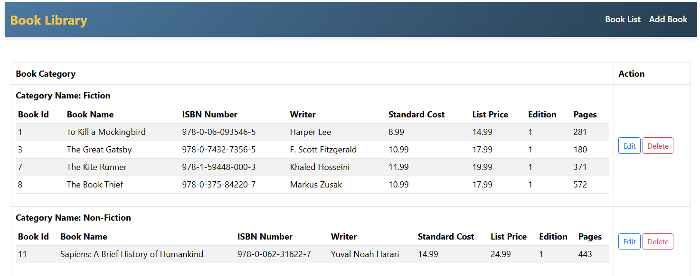
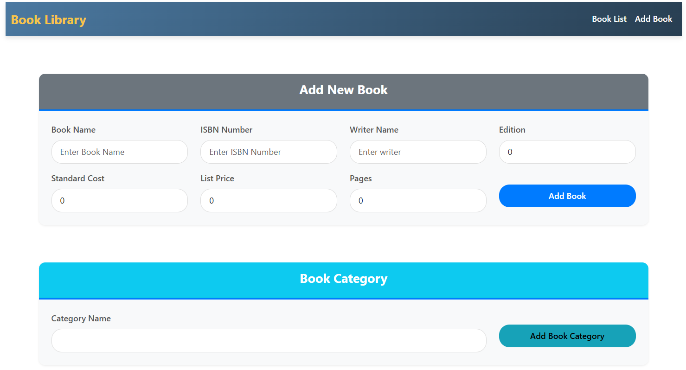
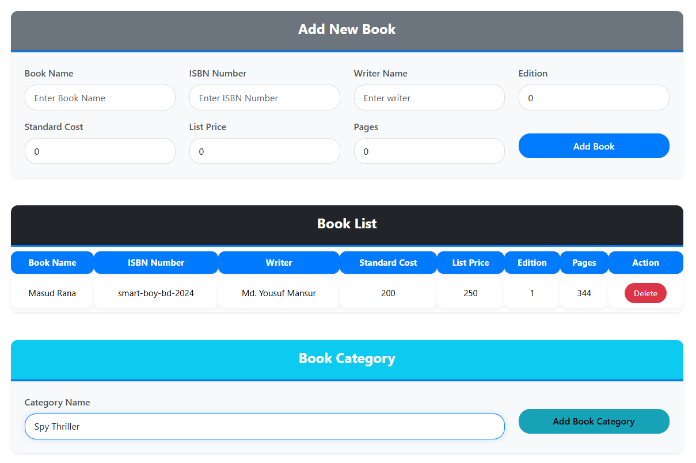
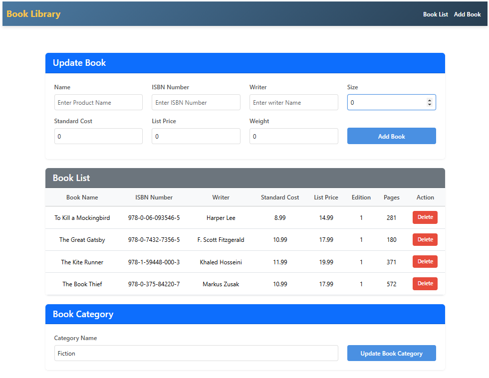

---

# Books Management System

This project demonstrates a CRUD (Create, Read, Update, Delete) application for managing books, built using Angular for the front end and ASP.NET Core Web API for the server side. It was developed as part of a monthly evidence exam, showcasing skills in modern web development practices and integration of client-server architecture.

## Features

- **Angular** front end with component-based architecture.
- **ASP.NET Core Web API** for handling server-side operations.
- **CRUD operations** for managing books with associated categories.
- **Responsive design** for an optimal user experience.

## Prerequisites

- **.NET 8.0 LTS**
- **Angular CLI 18**
- **Visual Studio 2022** or later / Visual Studio Code
- **SQL Server**

## Installation

1. Clone the repositories:

   ```bash
   git clone https://github.com/yousuf-mansur/books-client-side-angular-evidence.git
   ```

    ```bash
   https://github.com/yousuf-mansur/books-api-angular-evidence.git
   ```

2. **Open the project in Visual Studio (for the server-side):**
   - Open the `.sln` file to load the solution.

3. **Restore NuGet Packages (if necessary):**
   - Go to Tools > NuGet Package Manager > Package Manager Console.
   - Run the following command:

     ```bash
     Update-Package -reinstall
     ```

4. **Set up the Database:**
   - In the Package Manager Console, run:

     ```bash
     Update-Database
     ```

5. **Set up Angular (client-side):**
   - Navigate to the Angular project directory:

     ```bash
     cd bookCategories
     ```

   - Install dependencies if needed:

     ```bash
     npm install
     ```

6. **Run the Application:**

   - Start the API server in Visual Studio (Press F5 or use the Start button).
   - Run the Angular client:

     ```bash
     ng serve
     ```

7. **Access the application:**  
   The application should open at `http://localhost:4200` in your default browser.

## Screenshots

1. **List View**  
   

2. **Insert Books View**  
   

3. **Insert Book with Category**  
   

4. **Update Book View**  
   

## Usage

The application supports creating, viewing, updating, and deleting books with associated categories. The frontend handles data asynchronously using Angular services, providing smooth navigation and responsiveness.

## Project Structure

- **Angular (Client-side) Components/** - Implements the front-end UI.


## Technologies Used

- **ASP.NET Core Web API 8.0**
- **Entity Framework Core**
- **Angular CLI 18**
- **SQL Server**

## About Me

I am Md. Yousuf Mansur, a full-stack developer specializing in web applications with skills in:

- **ASP.NET Core and ASP.NET MVC**
- **Angular and React** for client-side development
- **Entity Framework Core**
- **SQL Server management**
- **RESTful APIs**

Starting my journey with an IsDB-BISEW scholarship, I’m now skilled in developing various web applications.

- **Contact:**
  - **Email:** mansurmdyousuf@gmail.com
  - **LinkedIn:** [Md. Yousuf Mansur](https://www.linkedin.com/in/md-yousuf-mansur/)
